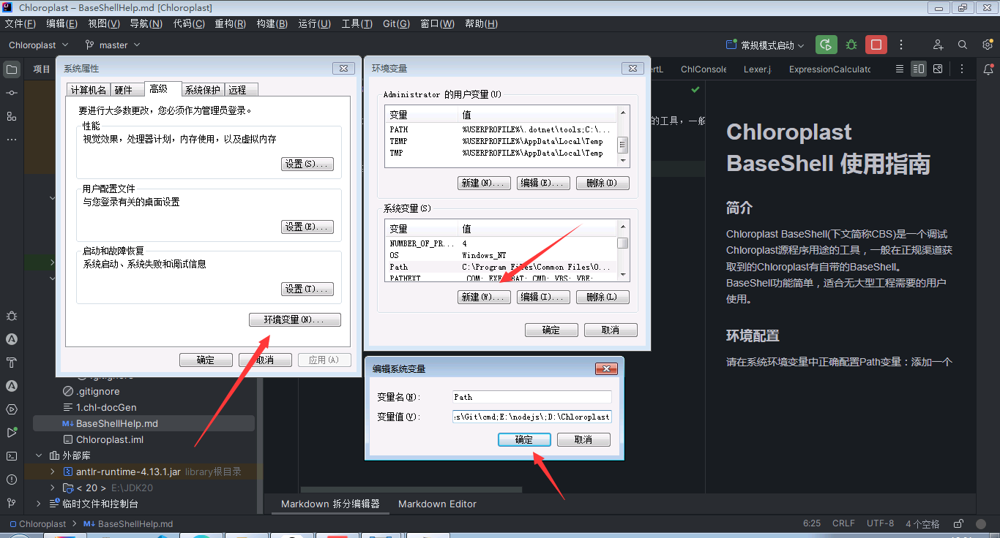

# Chloroplast BaseShell 使用指南
### 简介
Chloroplast BaseShell(下文简称CBS)是一个调试Chloroplast源程序用途的工具，一般在正规渠道获取到的Chloroplast有自带的BaseShell。<br>
BaseShell功能简单，适合无大型工程需要的用户使用。
### 环境配置
请在系统环境变量中正确配置Path变量：添加一个变量，值为Chloroplast的安装路径。

其余类型操作系统，如Linux和MacOS，请参照官方文档进行操作。
### 命令
可以在BaseShell中输入“help”获取命令。
#### 特殊命令
chl - 以指定附加参数运行chl源文件<br>
参数如下：<br>
&#8194; -f - 指定将要运行的文件路径。<br>
&#8194; -o - 指定联合编译，此后的内容都会被视作路径。<br>
&#8194; -log 指定调试功能日志输出<br>
&#8194; -dcv 指定调试功能检查变量，源文件所有定义出的变量与它们的值会在运行结束时一一罗列在BaseShell中。此选项在需要查看变量值时有很大用处。<br>
### 联合编译
Chloroplast提供了联合编译，可以将所有指定的文件整合成car包。用法如下：<br>
```bash
chl -o D:\文件1.chl D:\文件2.chl D:\文件3.chl
```
整合后的car文件自带一个Manifest.txt，可以直接用car命令运行，Chloroplast会自己找到主程序。
```bash
car -r X:\example.car
```
（实际上联合编译与C语言的gcc -o calc没有本质区别，联合编译只是多文件编译的另一个名字。）
